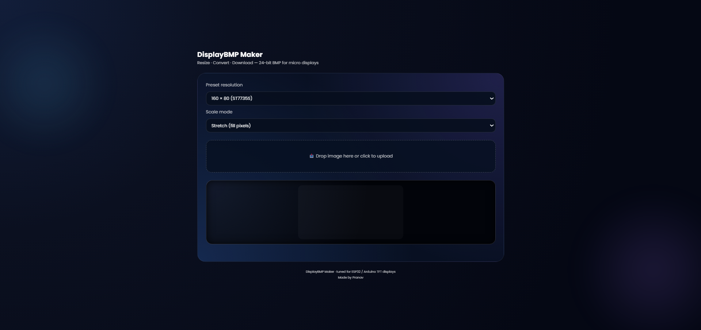

# DisplayBMP Maker
### Convert JPG/PNG to 24-bit BMP for ESP32, Arduino, ST7735, ST7789 & TFT Displays

DisplayBMP Maker is a fast and free online tool that converts images into **24-bit BMP files** optimized for microcontroller graphics.  
Perfect for displays like **ST7735, ST7789, ILI9341, SSD1306, SH1106**, and any TFT/OLED modules used with **ESP32 / Arduino**.

🔗 **Try it here:**  
https://pranavdixiit.github.io/bmp-converter

---

## ⭐ Features

- 🖼️ Convert **JPG/PNG → 24-bit BMP**
- 📏 Resize to popular TFT & OLED resolutions
- ⚙️ Custom width/height support
- 🧱 Supports multiple aspect handling:
  - Stretch
  - Fit (letterbox)
  - Fill (crop)
- 🔍 Pixel-perfect preview with scroll
- 📱 Works on all devices (mobile + desktop)
- ⚡ Fast client-side processing (no server needed)
- 🎨 Clean glass-morphic UI

---

## 📺 Supported Screen Resolutions

### **TFT / ST77xx**
- 160×80
- 128×128
- 128×160
- 240×240
- 240×320
- 320×480

### **OLED**
- 128×64
- 128×32

### **Special / IPS**
- 135×240  
- 170×320  
- 172×320  
- 480×800  

### **Custom**
You can enter any width × height manually.

---

## 🚀 Why Use This Tool?

Unlike generic converters, DisplayBMP Maker generates **proper, uncompressed, microcontroller-friendly 24-bit BMPs**, fully compatible with:

- **TFT_eSPI**
- **Adafruit GFX**
- **Arduino Graphics**
- **ESP-IDF LCD drivers**
- **LVGL raw BMP loaders**

Most online converters output formats that **do not load correctly** on embedded systems.  
This tool fixes that.

---

## 🧩 How It Works

1. Choose a display resolution  
2. Upload your image  
3. Choose scale mode  
4. Preview + scroll if image is larger  
5. Download BMP  

All processing happens **locally in your browser** — your images are never uploaded.

---

## 🛠️ Tech Used

- HTML / CSS / JavaScript
- Canvas API
- Glass-morphic UI styling
- GitHub Pages hosting

---

## 🖼️ Preview

---

## 📄 License

This project is open-source and free to use.

---

## 👤 Developer

Created by **Pranav**  
For embedded developers, hobbyists, and makers ❤️

